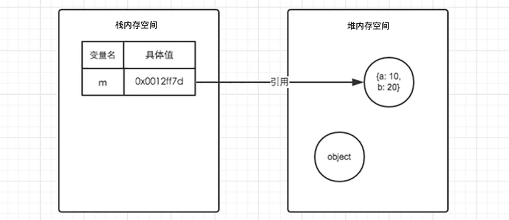
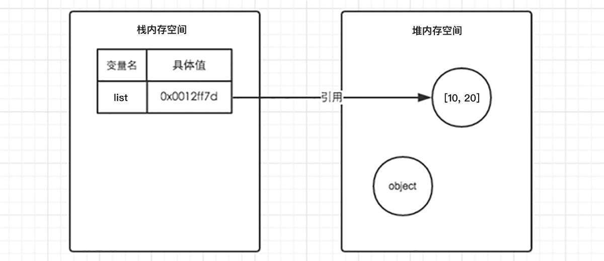

### 三、解构赋值

> 知道解构的语法及分类，使用解构简洁语法快速为变量赋值。

解构赋值是一种快速为变量赋值的简洁语法，本质上仍然是为变量赋值，分为数组解构、对象解构两大类型。

#### 3.1 数组解构

数组解构是将数组的单元值快速批量赋值给一系列变量的简洁语法，如下代码所示：

```html
<script>
  // 普通的数组
  let arr = [1, 2, 3];
  // 批量声明变量 a b c 
  // 同时将数组单元值 1 2 3 依次赋值给变量 a b c
  let [a, b, c] = arr;
  console.log(a); // 1
  console.log(b); // 2
  console.log(c); // 3
</script>
```

总结：

1. 赋值运算符 `=` 左侧的 `[]` 用于批量声明变量，右侧数组的单元值将被赋值给左侧的变量
2. 变量的顺序对应数组单元值的位置依次进行赋值操作
3. 变量的数量大于单元值数量时，多余的变量将被赋值为  `undefined`
4. 变量的数量小于单元值数量时，可以通过 `...` 获取剩余单元值，但只能置于最末位
5. 允许初始化变量的默认值，且只有单元值为 `undefined` 时默认值才会生效

注：支持多维解构赋值，比较复杂后续有应用需求时再进一步分析

#### 3.2 对象解构

对象解构是将对象属性和方法快速批量赋值给一系列变量的简洁语法，如下代码所示：

```html
<script>
  // 普通对象
  let user = {
    name: '小明',
    age: 18
  };

  // 批量声明变量 name age
  // 同时将数组单元值 1 2 3 依次赋值给变量 a b c
  let {name, age} = user;

  console.log(name); // 小明
  console.log(age); // 18
</script>
```

总结：

1. 赋值运算符 `=` 左侧的 `{}` 用于批量声明变量，右侧对象的属性值将被赋值给左侧的变量
2. 对象属性的值将被赋值给与属性名相同的变量
3. 对象中找不到与变量名一致的属性时变量值为 `undefined`
4. 允许初始化变量的默认值，属性不存在或单元值为 `undefined` 时默认值才会生效

注：支持多维解构赋值，比较复杂后续有应用需求时再进一步分析


## JavaScript 进阶 - 第2天

> 了解面向对象编程的基础概念及构造函数的作用，体会 JavaScript 一切皆对象的语言特征，掌握常见的对象属性和方法的使用。

- 了解面向对象编程中的一般概念
- 能够基于构造函数创建对象
- 理解 JavaScript 中一切皆对象的语言特征
- 理解引用对象类型值存储的的特征
- 掌握包装类型对象常见方法的使用

### 一、面向对象

> 了解面向对象的基础概念，能够利用构造函数创建对象。

#### 1.1 构造函数

构造函数是专门用于创建对象的函数，如果一个函数使用 `new` 关键字调用，那么这个函数就是构造函数。

```html
<script>
  // 定义函数
  function foo() {
    console.log('通过 new 也能调用函数...');
  }
  // 调用函数
  new foo;
</script>
```

总结：

2. 使用 `new` 关键字调用函数的行为被称为实例化
3. 实例化构造函数时没有参数时可以省略 `()`
4. 构造函数的返回值即为新创建的对象
5. 构造函数内部的 `return` 返回的值无效！

注：实践中为了从视觉上区分构造函数和普通函数，习惯将构造函数的首字母大写。

#### 1.2 实例成员

通过构造函数创建的对象称为实例对象，实例对象中的属性和方法称为实例成员。

```html
<script>
  // 构造函数
  function Person() {
    // 构造函数内部的 this 就是实例对象

    // 实例对象中动态添加属性
    this.name = '小明';
    // 实例对象动态添加方法
    this.sayHi = function () {
      console.log('大家好~');
    }
  }

  // 实例化，p1 是实例对象
  // p1 实际就是 构造函数内部的 this
  let p1 = new Person();

  console.log(p1);
  console.log(p1.name); // 访问实例属性
  p1.sayHi(); // 调用实例方法
</script>
```

总结：

1. 构造函数内部 `this` 实际上就是实例对象，为其动态添加的属性和方法即为实例成员
2. 为构造函数传入参数，动态创建结构相同但值不同的对象
3. 实例对象的 `constructor`  属性指向了构造函数
4. `instanceof` 用于检测实例对象对应的构造函数

注：构造函数创建的实例对象彼此独立互不影响。

#### 1.3 静态成员

在 JavaScript 中底层函数本质上也是对象类型，因此允许直接为函数动态添加属性或方法，构造函数的属性和方法被称为静态成员。

```html
<script>
  // 构造函数
  function Person(name, age) {
    // 省略实例成员
  }

  // 静态属性
  Person.eyes = 2;
  Person.arms = 2;
  // 静态方法
  Person.walk = function () {
    console.log('^_^人都会走路...');
    // this 指向 Person
    console.log(this.eyes);
  }
</script>
```

总结：

1. 静态成员指的是添加到构造函数本身的属性和方法
2. 一般公共特征的属性或方法静态成员设置为静态成员
3. 静态成员方法中的 `this` 指向构造函数本身

### 二、一切皆对象

> 体会 JavaScript 一切皆对象的语言特征，掌握各引用类型和包装类型对象属性和方法的使用。

在 JavaScript 中**最主要**的数据类型有 6 种，分别是字符串、数值、布尔、undefined、null 和 对象，常见的对象类型数据包括数组和普通对象。其中字符串、数值、布尔、undefined、null 也被称为简单类型或基础类型，对象也被称为引用类型。

在 JavaScript 内置了一些构造函数，绝大部的数据处理都是基于这些构造函数实现的，JavaScript 基础阶段学习的 `Date` 就是内置的构造函数。

```html
<script>
  // 实例化
	let date = new Date();
  
  // date 即为实例对象
  console.log(date);
    
    
    简单数据类型：字符串、数字、布尔、undefined、null
    (引用类型)复杂数据类型：对象（数组）
    
</script>
```

甚至字符串、数值、布尔、数组、普通对象也都有专门的构造函数，用于创建对应类型的数据。

#### 2.1 引用类型

##### Object

`Object` 是内置的构造函数，用于创建普通对象。

```html
<script>
  // 通过构造函数创建普通对象
  let user = new Object({name: '小明', age: 15});

  // 这种方式声明的变量称为【字面量】
  let student = {name: '杜子腾', age: 21}
  
  // 对象语法简写
  let name = '小红';
  let people = {
    // 相当于 name: name
    name,
    // 相当于 walk: function () {}
    walk () {
      console.log('人都要走路...');
    }
  }

  console.log(student.constructor);
  console.log(user.constructor);
  console.log(student instanceof Object);
</script>
```

下图展示了普通对象在内存中的存储方式：普通对象数据保存在堆内存之中，栈内存中保存了普通对象在堆内存的地址。




普能对象在赋值时只是复制了栈内中的地址，而非堆内存中的数据，如下图所示：


普通对象赋值后，无论修改哪个变量另一个对象的数据值也会相当发生改变。

总结：

1. 推荐使用字面量方式声明对象，而不是 `Object` 构造函数
2. `Object.assign` 静态方法创建新的对象
3. `Object.keys` 静态方法获取对象中所有属性
4. `Object.values` 表态方法获取对象中所有属性值

面试回答堆与栈的区别：

1. 堆和栈是内存中的数据存储空间
2. 简单类型的数据保存在内存的栈空间中
3. 引用类型的数据保存在内存的堆空间中，栈内存中存取的是引用类型的地址（房间号）

##### Array

`Array` 是内置的构造函数，用于创建数组。

```html
<script>
  // 构造函数创建数组
  let arr = new Array(5, 7, 8);

  // 字面量方式创建数组
  let list = ['html', 'css', 'javascript'];

  console.log(list.constructor);
  console.log(list instanceof Array);
</script>

```

数组在内存中的存储方式与普通对象一样，如下图所示：



数组在赋值时只是复制了栈内中的地址，而非堆内存中的数据，如下图所示：


数组赋值后，无论修改哪个变量另一个对象的数据值也会相当发生改变。

总结：

1. 推荐使用字面量方式声明数组，而不是 `Array` 构造函数
2. 实例方法 `forEach` 用于遍历数组，替代 `for` 循环
3. 实例方法 `filter` 过滤数组单元值，生成新数组
4. 实例方法 `map` 迭代原数组，生成新数组
5. 实例方法 `join` 数组单元素拼接成了符串
6. 实例方法 `concat`  合并两个数组，生成新数组
7. 实例方法 `sort` 对原数组单元值排序
8. 实例方法 `splice` 删除或替换原数组单元
9. 实例方法 `indexOf` 检索数组单元值
10. 实例方法 `reverse` 反转数组
11. 静态方法 `from` 伪数组转成数组

##### RegExp

`RegExp` 内置的构造函数，用于创建正则表达式。

Regular Expression

```html
<script>
  // 构造函数创建正则
  let reg = new RegExp('\d', 'i');

  // 字面量方式创建正则
  // let reg = /(\d)/i;

  reg.exec('123');
</script>
```

总结：

1. 推荐使用字面量定义正则表达式，而不是 `RegExp` 构造函数
2. `RegExp` 静态属性 $1、$2、$3、... 获取正则分组单元

补充：当使用构造函数创建正则时有两种写法：

```html
<script>
  // 使用 // 定义正则
  let reg = new RegExp(/\d/);
  
  // 或者使用 '' 定义正则
  // 如果使用引号定义正则时，\d、\s、\w
    需要多添加一个 \
  let reg1 = new RegExp('\\d');
</script>
```

#### 2.2 包装类型

在 JavaScript 中的字符串、数值、布尔具有对象的使用特征，如具有属性和方法，如下代码举例：

```html
<script>
  // 字符串类型
  let str = 'hello world!';
 	// 统计字符的长度（字符数量）
  console.log(str.length);
  
  // 数值类型
  let price = 12.345;
  // 保留两位小数
  price.toFixed(2);
</script>
```

之所以具有对象特征的原因是字符串、数值、布尔类型数据是 JavaScript 底层使用 Object 构造函数“包装”来的，被称为包装类型。

##### String

`String` 是内置的构造函数，用于创建字符串。

```html
<script>
  // 使用构造函数创建字符串
  let str = new String('hello world!');

  // 字面量创建字符串
  let str2 = '你好，世界！';

  // 检测是否属于同一个构造函数
  console.log(str.constructor === str2.constructor); // true
  console.log(str instanceof String); // false
</script>
```

总结：

1. 推荐使用字面量方式声明字符串，而不是 `String` 构造函数
2. 实例属性 `length` 用来获取字符串的度长
3. 实例方法 `split` 用来将字符串拆分成数组
4. 实例方法 `toUpperCase` 用于将字母转换成大写
5. 实例方法 `toLowerCase` 用于将字母转换成小写
6. 实例方法 `slice` 用于字符串截取
7. 实例方法 `indexOf`  检测是否包含某字符
8. 实例方法 `startsWith` 检测是否以某字符开头
9. 实例方法 `endsWith` 检测是否以某字符结尾
10. 实例方法 `replace` 用于替换字符串，支持正则匹配
11. 实例方法  `padStart` 固定长度字符开始位置打补丁
12. 实例方法  `padEnd` 固定长度字符结束位置打补丁
13. 实例方法 `match` 用于查找字符串，支持正则匹配

注：String 也可以当做普通函数使用，这时它的作用是强制转换成字符串数据类型。

##### Number

`Number` 是内置的构造函数，用于创建数值。

```html
<script>
  // 使用构造函数创建数值
  let x = new Number('10');
  let y = new Number(5);

  // 字面量创建数值
  let z = 20;

  // 检测是否属于同一个构造函数
  console.log(x.constructor === z.constructor);
</script>
```

总结：

1. 推荐使用字面量方式声明数值，而不是 `Number` 构造函数
2. 实例方法 `toFixed` 用于设置保留小数位的长度

注：Number 也可以当做普通函数使用，这时它的作用是强制转换成数值数据类型。

##### Boolean

`Boolean` 是内置的构造函数，用于创建布尔值。

```html
<script>
  // 使用构造函数创建布尔类型
  let locked = new Boolean('10');

  // 字面量创建布尔类型
  let flag = true;

  // 检测是否属于同一个构造函数
  console.log(locked.constructor === flag.constructor);
</script>
```

总结：

1. 推荐使用字面量方式声明布尔值，而不是 `Boolean` 构造函数

注：Boolean 也可以当做普通函数使用，这时它的作用是强制转换成布尔类型数据，由其它数据类型转换成布尔类型的数据被称为真值（truly）或假值（falsly）。

#### 2.3 写在最后

至此对 JavaScript 有了更深的理解，即 JavaScript 中一切皆为对象，还有以前学习的 window、Math 对象，最后补充一点无论是引用类型或是包装包类型都包含两个公共的方法 `toString` 和 `valueOf`

```html
<script>
  // 对象类型数据
  let user = {name: '小明', age: 18}
  // 数值类型	 
  let num = 12.345;
  // 字符串类型
  let str = 'hello world!';
  
  str.valueOf(); // 原始值
  user.toString(); // 表示该对象的字符串
</script>
```

总计：

1. `valueOf` 方法获取原始值，数据内部运算的基础，很少主动调用该方法
2. `toString` 方法以字符串形式表示对象

