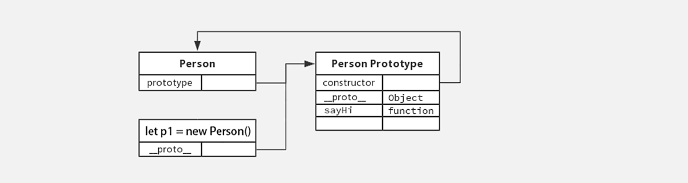
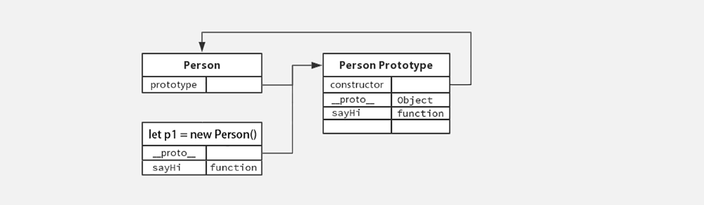
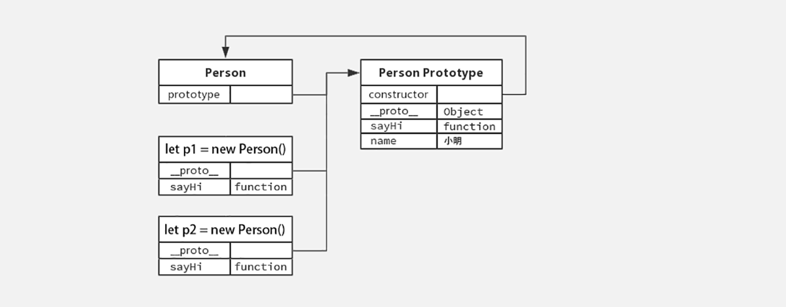
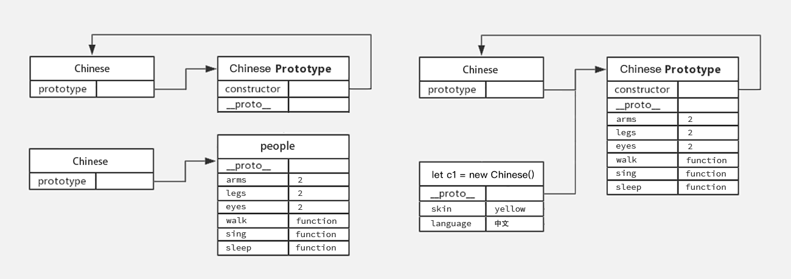
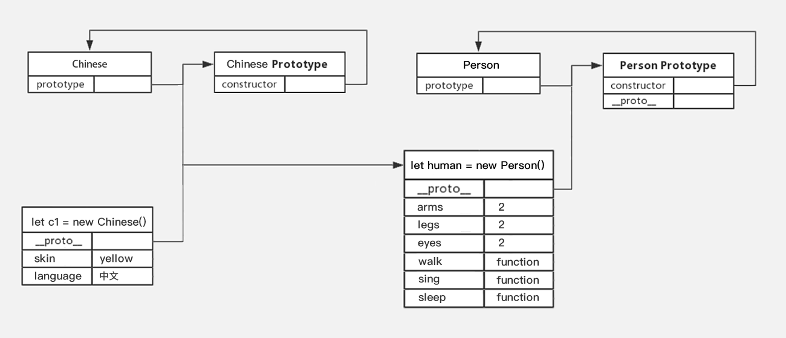
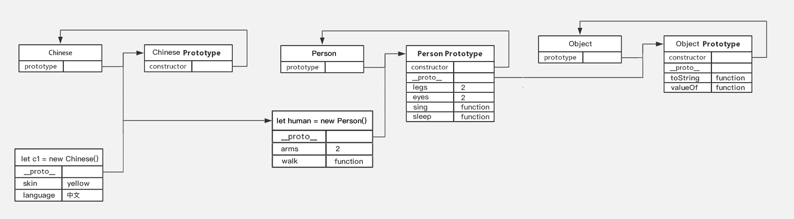

## JavaScript 进阶 - 第3天

> 了解构造函数原型对象的语法特征，掌握 JavaScript 中面向对象编程的实现方式，基于面向对象编程思想实现 DOM 操作的封装。

- 了解面向对象编程的一般特征
- 掌握基于构造函数原型对象的逻辑封装
- 掌握基于原型对象实现的继承
- 理解什么原型链及其作用
- 能够处理程序异常提升程序执行的健壮性

### 一、面向对象

> 学习 JavaScript 中基于原型的面向对象编程序的`语法实现，理解面向对象编程的特征。

面向对象编程是一种程序设计思想，它具有 3 个显著的特征：封装、继承、多态。

#### 1.1 封装

封装的本质是将具有关联的代码组合在一起，其优势是能够保证代码复用且易于维护，函数是最典型也是最基础的代码封装形式，面向对象思想中的封装仍以函数为基础，但提供了更高级的封装形式。

##### 命名空间

先来回顾一下以往代码封装的形式：

```html
<script>
  // 普通对象（命名空间）形式的封装
  let beats = {
    name: '狼',
    setName: function (name) {
      this.name = this.name;
    },
    getName() {
      console.log(this.name);
    }
  }

  beats.setName('熊');
  beats.getName();
</script>
```

以往以普通对象（命名空间）形式封装的代码只是单纯把一系列的变量或函数组合到一起，所有的数据变量都被用来共享（使用 this 访问）。

##### 构造函数

对比以下通过面向对象的构造函数实现的封装：

```html
<script>
  function Person() {
    this.name = '佚名';
    // 设置名字
    this.setName = function (name) {
      this.name = name;
    }
    // 读取名字
    this.getName = () => {
      console.log(this.name);
    }
  }

  // 实例对像，获得了构造函数中封装的所有逻辑
  let p1 = new Person();
  p1.setName('小明');
  console.log(p1.--name);// 小明

  // 实例对象
  let p2 = new Person();
  console.log(p2.name); // 佚名
</script>
```

构造函数相当于一个"模子"，能够像字面量那样创建出对象来，所不同的是借助构造函数创建出来的实例对象之间是**彼此不影响**的。

总结：

1. 构造函数体现了面向对象的封装特性
2. 构造函数实例创建的对象彼此独立、互不影响
3. 命名空间式的封装无法保证数据的独立性

注：可以举一些例子，如女娲造人等例子，加深对构造函数的理解。

##### 原型对象

实际上每一个构造函数都有一个名为 `prototype` 的属性，译成中文是原型的意思，`prototype` 的是对象类据类型，称为构造函数的原型对象，每个原型对象都具有 `constructor` 属性代表了该原型对象对应的构造函数。

```html
<script>
  function Person() {
    
  }

  // 每个函数都有 prototype 属性
  console.log(Person.prototype);
</script>
```

如下图所示：


了解了 JavaScript 中构造函数与原型对象的关系后，再来看原型对象具体的作用，如下代码所示：

```html
<script>
  function Person() {
    // 此处未定义任何方法
  }

  // 为构造函数的原型对象添加方法
  Person.prototype.sayHi = function () {
    console.log('Hi~');
  }
	
  // 实例化
  let p1 = new Person();
  p1.sayHi(); // 输出结果为 Hi~
</script>
```

其结构如图所示：



构造函数 `Person` 中未定义任何方法，这时实例对象调用了原型对象中的方法 `sayHi`，接下来改动一下代码：

```html
<script>
  function Person() {
    // 此处定义同名方法 sayHi
    this.sayHi = function () {
      console.log('嗨!');
    }
  }

  // 为构造函数的原型对象添加方法
  Person.prototype.sayHi = function () {
    console.log('Hi~');
  }

  let p1 = new Person();
  p1.sayHi(); // 输出结果为 嗨!
</script>
```



构造函数 `Person` 中定义与原型对象中相同名称的方法，这时实例对象调用则是构造函中的方法 `sayHi`。

通过以上两个简单示例不难发现 JavaScript 中对象的工作机制：**当访问对象的属性或方法时，先在当前实例对象是查找，然后再去原型对象查找，并且原型对象被所有实例共享。**

```html
<script>
  function Person() {
    // 此处定义同名方法 sayHi
    this.sayHi = function () {
      console.log('嗨!' + this.name);
    }
  }

  // 为构造函数的原型对象添加方法
  Person.prototype.sayHi = function () {
    console.log('Hi~' + this.name);
  }
  // 在构造函数的原型对象上添加属性
  Person.prototype.name = '小明';

  let p1 = new Person();
  p1.sayHi(); // 输出结果为 嗨!
  
  let p2 = new Person();
  p2.sayHi();
</script>
```



 什么是原型对象？？

 答：是构造函数的一个属性，它的数据类型是对象

 原型对象有啥用？？

 答：原型对象对应的构造函数的实例方法或属性不存在时会去查找原型对象

总结：**结合构造函数原型的特征，实际开发重往往会将封装的功能函数添加到原型对象中。**

#### 1.2 继承

继承是面向对象编程的另一个特征，通过继承进一步提升代码封装的程度，JavaScript 中大多是借助原型对象实现继承的特性。

龙生龙、凤生凤、老鼠的儿子会打洞描述的正是继承的含义，分别封装中国人和日本人的行为特征来理解编程中继承的含义，代码如下：

```html
<script>
  // 封装中国人的行为特征
  function Chinese() {
    // 中国人的特征
    this.arms = 2;
    this.legs = 2;
    this.eyes = 2;

    this.skin = 'yellow';
    this.language = '中文';

    // 中国人的行为
    this.walk = function () {}
    this.sing = function () {}
    this.sleep = function () {}
  }

  // 封装日本人的行为特征
  function Japanese() {
    // 日本人的特征
    this.arms = 2;
    this.legs = 2;
    this.eyes = 2;

    this.skin = 'yellow';
    this.language = '日文';

    // 日本人的行为
    this.walk = function () {}
    this.sing = function () {}
    this.sleep = function () {}
  }
</script>
```

其实我们都知道无论是中国人、日本人还是其它民族，人们的大部分特征是一致的，然而体现在代码中时人的相同的行为特征被重复编写了多次，代码显得十分冗余，我们可以将重复的代码抽离出来：

##### 原型继承

基于构造函数原型对象实现面向对象的继承特性。

```html
<script>
  // 所有人
  function Person() {
    // 人的特征
    this.arms = 2;
    this.legs = 2;
    this.eyes = 2;
    
    // 人的行为
    this.walk = function () {}
    this.sing = function () {}
    this.sleep = function () {}
  }
  
  // 中国人
  function Chinese() {
    this.skin = 'yellow';
    this.language = '中文';
  }
  // 日本人
  function Japanese() {
    this.skin = 'yellow';
    this.language = '日文';
  }
</script>
```

上述代码可以理解成将 `Chinese` 和 `Japanese` 共有的属性和方法提取出来了，也就是说 `Chinese` 和 `Japanese` 需要【共享】一些属性和方法，而原型对象的属性和方法恰好是可以被用来共享的，因此我们看如下代码：

```html
<script>
  // 中国人
  function Chinese() {
    this.skin = 'yellow';
    this.language = '中文';
  }
  // 日本人
  function Japanese() {
    this.skin = 'yellow';
    this.language = '日文';
  }
  
  // 人们【共有】的行为特征
  let people = {
    // 人的特征
    arms: 2,
    legs: 2,
    eyes:2,
    // 人的行为
    walk: function () {},
    sleep: function () {},
    sing: function () {}
  }
  
  // 为 prototype 重新赋值
  Chinese.prototype = people;
  Chinese.prototype.constructor = Chinese;
</script>
```

如下图所示：



创建对象 `people` 将公共的的属性和方法独立出来，然后赋值给构造函数的 `prototype` 这样无论有多少个民族都可以共享公共的属性和方法了：

```html
<script>
  // 人们【共有】的行为特征
  let people = {
    // 人的特征
    arms: 2,
    legs: 2,
    eyes:2,
    // 人的行为
    walk: function () {},
    sleep: function () {},
    sing: function () {}
  }
  
  // 中国人
  function Chinese() {
    this.skin = 'yellow';
    this.language = '中文';
  }
  // 日本人
  function Japanese() {
    this.skin = 'yellow';
    this.language = '日文';
  }
  
  function Englist() {
    this.skin = 'white';
    this.language= '英文';
  }
  
  // 中国人
  Chinese.prototype = people;
  Chinese.prototype.constructor = Chinese;
  
  let c1 = new Chinese();
 	
  // 日本人
  Japanese.prototype = people;
  Janpanese.prototype.constructor = Japanese;
  // 英国人
  English.prototype = people;
  English.prototype.constructor = English;
  
  // ...
</script>
```

继承是一种可以“不劳而获”的手段！！！上述代码中 `Chinese`、`Japanese`、`English` 都轻松的获得了 `people` 的公共的方法和属性，我们说 `Chinese`、`Japanese`、`English` 继承了 `people`。

上述代码中是以命名空间的形式实现的继承，事实上 JavaScript 中继承更常见的是借助构造函数来实现：

```html
<script>
  // 所有人
  function Person() {
    // 人的特征
    this.arms = 2;
    this.legs = 2;
    this.eyes = 2;

    // 人的行为
    this.walk = function () {}
    this.sing = function () {}
    this.sleep = function () {}
  }

  // 封装中国人的行为特征
  function Chinese() {
    // 中国人的特征
    this.skin = 'yellow';
    this.language = '中文';
  }

  // 封装日本人的行为特征
  function Japanese() {
    // 日本人的特征
    this.skin = 'yellow';
    this.language = '日文';
  }

  // human 是构造函数 Person 的实例
  let human = new Person();

  // 中国人
  Chinese.prototype = new Person();
  Chinese.prototype.constructor = Chinese;
  // 日本人
  Japanese.prototype = human;
  Japanese.prototype.constructor = Japanese;
</script>
```

如下图所示：



##### 原型链

基于原型对象的继承使得不同构造函数的原型对象关联在一起，并且这种关联的关系是一种链状的结构，我们将原型对象的链状结构关系称为原型链，如下图所示：



```html
作用：用于查找成员提供机制

<script>
  // Person 构造函数
  function Person() {
    this.arms = 2;
    this.walk = function () {}
  }
	
  // Person 原型对象
  Person.prototype.legs = 2;
  Person.prototype.eyes = 2;
  Person.prototype.sing = function () {}
  Person.prototype.sleep = function () {}
	
  // Chinese 构造函数
  function Chinese() {
    this.skin = 'yellow';
    this.language = '中文';
  }
	
  // Chinese 原型对象
  Chinese.prototype = new Person();
  Chinese.prototype.constructor = Chinese;
	
  // 实例化
  let c1 = new Chinese();
  console.log(c1);
</script>
```

在 JavaScript 对象中包括了一个非标准备的属性 `__proto__` 它指向了构造函数的原型对象，通过它可以清楚的查看原型对象的链状结构。


#### 1.3 写在最后

面向对象（OOP）是编程时的一种指导思想，需要通过不断的实践才能体会面向对象编程的优势，在 JavaScript 中面向对象编程的实现是以构造函数和原型对象为核心的，因此掌握构造函数和原型对象的语法是灵活运用面向对象的基础。

面向对象多态的特性在 JavaScript 中应用场景相对较少，本次课中暂不讲解。

### 二、异常处理

> 了解 JavaScript 中程序异常处理的方法，提升代码运行的健壮性。

##### 2.1 throw

异常处理是指预估代码执行过程中可能发生的错误，然后最大程度的避免错误的发生导致整个程序无法继续运行。

```html
<script>
  function counter(x, y) {

    if(!x || !y) {
      // throw '参数不能为空!';
      throw new Error('参数不能为空!');
    }

    return x + y;
  }

  counter();
</script>
```

总结：

1. `throw` 抛出异常信息，程序也会终止执行
2. `throw` 后面跟的是错误提示信息
3. `Error` 对象配合 `throw` 使用，能够设置更详细的错误信息

##### 2.2 try ... catch

```html
<script>
  function foo() {

    try {
      // 查找 DOM 节点
      var p = docunent.querySelector('p');

    } catch(error) {
      // try 代码段中执行有错误时，会执行 catch 代码段

      // 查看错误信息
      console.log(error.message);

      // 终止代码继续执行
      return;
    }

    // 改变文本样式
    p.style.color = 'red';
  }

  foo();
</script>
```

总结：

1. `try...catch` 用于捕获错误信息
2. 将预估可能发生错误的代码写在 `try` 代码段中
3. 如果 `try` 代码段中出现错误后，会执行 `catch` 代码段，并截获到错误信息